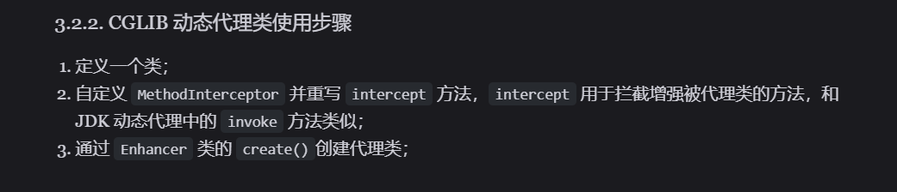

## Cglib 动态代理

Jdk 动态代理有一个致命的问题就是，只能代理实现了接口的类。(原因实际是生成了一个实现同一个接口的代理对象，用代理对象调用实际对象的方法)

> CGLIB(Code Generation Library)是一个基于ASM的字节码生成库，它允许我们在运行时对字节码进行修改和动态生成。
> CGLIB 通过继承方式实现代理。很多知名的开源框架都使用到了CGLIB， 
> 例如 Spring 中的 AOP 模块中：如果目标对象实现了接口，则默认采用 JDK 动态代理，否则采用 CGLIB 动态代理。

在 CGLIB 动态代理机制中 MethodInterceptor 接口和 Enhancer 类是核心。

你需要自定义 MethodInterceptor 并重写 intercept 方法，intercept 用于拦截增强被代理类的方法。

你可以通过 Enhancer类来动态获取被代理类，当代理类调用方法的时候，实际调用的是 MethodInterceptor 中的 intercept 方法



如果要使用 `Cglib` 动态代理，需要引入 `cglib` 依赖：

### Cglib 和 Jdk 代理的区别
JDK 动态代理只能代理实现了接口的类或者直接代理接口，而 CGLIB 可以代理未实现任何接口的类。 
另外， CGLIB 动态代理是通过生成一个被代理类的子类来拦截被代理类的方法调用，
因此不能代理声明为 final 类型的类和方法。就二者的效率来说，大部分情况都是 JDK 动态代理更优秀，随着 JDK 版本的升级，这个优势更加明显。

### 说明

**就从我们写的代码来看，Jdk 动态代理实际上是将原来的类包装了一下，调用原来的类之前，先调用自己造的类的方法。Cglib 实际用的是继承，
实现了一个原来类的子类，重写了原来类的方法。那用继承，就有了限制，final 类和 final 方法是不能被继承的，所以 Cglib 不能代理 final 类以及 final 方法**

**感觉静态代理，相对于动态的一个劣势就是，如果要代理的类有很多方法，那么我们就要写很多方法，而动态代理，只需要写一个 invoke 方法，就可以代理所有的方法。
并且原接口新加了方法，那么代理类也要改。而且静态代理是实现和目标对象同一个接口来做的，实际看 cglib 动态代理，我们也可以用继承来做**

```java
public class Main {
    public static void main(String[] args) {
        SmsService smsService = new SmsServiceImpl();
        SmsProxy smsProxy = new SmsProxy(smsService);
        smsProxy.send("java");
    }
}
```

```java
public class SmsProxy implements SmsService {

    private final SmsService smsService;

    public SmsProxy(SmsService smsService) {
        this.smsService = smsService;
    }

    @Override
    public String send(String message) {
        //调用方法之前，我们可以添加自己的操作
        System.out.println("before method send()");
        smsService.send(message);
        //调用方法之后，我们同样可以添加自己的操作
        System.out.println("after method send()");
        return null;
    }
}
```
