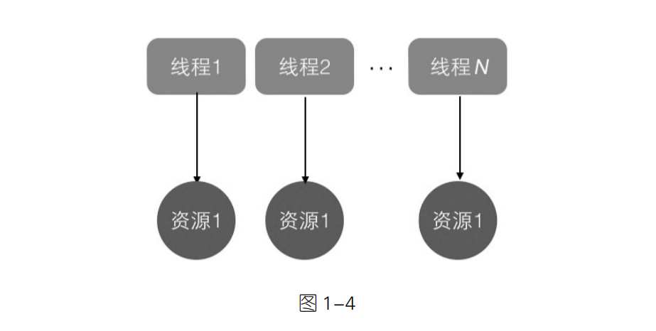
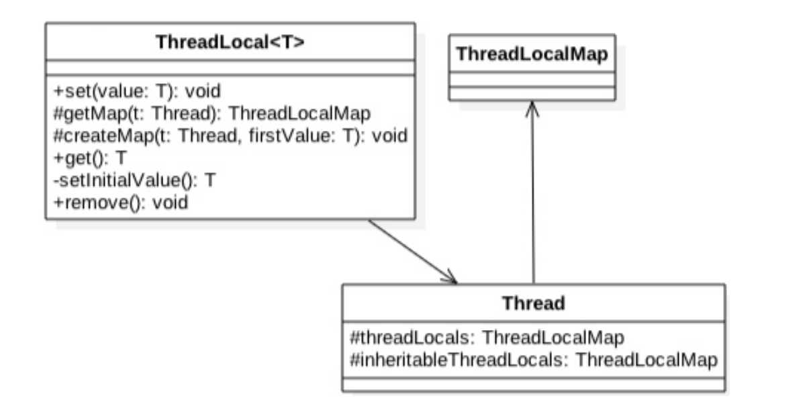
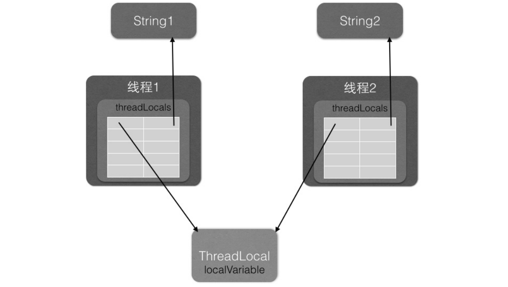

## 目录
### 第一章
- [1.1 线程 and 进程](#11-线程-and-进程)
- [1.2 线程的通知与等待](#12-线程的通知与等待)
- [1.3 join 方法](#13-join-方法)
- [1.4 sleep 方法](#14-sleep-方法)
- [1.5 让出 cpu 执行权的 yiled 方法](#15-让出-cpu-执行权的-yiled-方法)
- [1.6 线程中断](#16-线程中断)
- [1.7 理解上下文的切换](#17-理解上下文的切换)
- [1.8 线程死锁](#18-线程死锁)
- [1.9 守护线程与用户线程](#19-守护线程与用户线程)
- [1.10 ThreadLocal](#110-ThreadLocal)

### 1.1 线程 and 进程

线程是进程中的一个实体，线程本身不会单独存在。操作系统在分配资源的时候是分配给进程的，但是 cpu 比较特殊，是分配给线程的。
所以说，线程是 cpu 调度的最小单位。

在 Java 中，当我们启动 main 就是启动了一个 jvm 的进程，而 main 函数就是所在进程中的一个线程，也叫主线程。


一个进程中有多个线程，多个线程共享进程中的堆和方法区资源，但是每个线程有自己的程序计数器和栈。

程序计数器是一块内存区域，用来记录线程当前要执行的指令地址。那么为何要将
程序计数器设计为线程私有的呢？前面说了线程是占用 CPU 执行的基本单位，而 CPU一
般是使用时间片轮转方式让线程轮询占用的，所以当前线程 CPU 时间片用完后，要让出
CPU，等下次轮到自己的时候再执行。那么如何知道之前程序执行到哪里了呢？其实程序
计数器就是为了记录该线程让出 CPU 时的执行地址的，待再次分配到时间片时线程就可
以从自己私有的计数器指定地址继续执行。另外需要注意的是，如果执行的是 native 方法，
那么 pc 计数器记录的是 undefined 地址，只有执行的是 Java 代码时 pc 计数器记录的才是
下一条指令的地址。

另外每个线程都有自己的栈资源，用于存储该线程的局部变量，这些局部变量是该线
程私有的，其他线程是访问不了的，除此之外栈还用来存放线程的调用栈帧。

堆是一个进程中最大的一块内存，堆是被进程中的所有线程共享的，是进程创建时分
配的，堆里面主要存放使用 new 操作创建的对象实例。

方法区则用来存放 JVM 加载的类、常量及静态变量等信息，也是线程共享的。

在这里面讲了 3 种创建线程的方式：
1. 继承 Thread 类
2. 实现 Runnable 接口
3. 实现 Callable 接口

从我们看的设计模式来说，第二种和第三种比较好的，是使用组合的方式，而不是继承的方式。我们说组合优于继承。

```java
// 继承 Thread 类
public class MyThread extends Thread {
    @Override
    public void run() {
        System.out.println("MyThread");
    }
}

// main
public static void main(String[] args) {
    MyThread myThread = new MyThread();
    myThread.start();
}
```

```java
// 实现 Runnable 接口
public class MyRunnable implements Runnable {
    @Override
    public void run() {
        System.out.println("MyRunnable");
    }
}

// main
public static void main(String[] args) {
    MyRunnable myRunnable = new MyRunnable();
    Thread thread = new Thread(myRunnable);
    thread.start();
}
```

```java
// 实现 Callable 接口
public class MyCallable implements Callable<String> {
    @Override
    public String call() throws Exception {
        return "MyCallable";
    }
}

// main
public static void main(String[] args) {
    MyCallable myCallable = new MyCallable();
    FutureTask<String> futureTask = new FutureTask<>(myCallable);
    new Thread(futureTask).start();
    try {
        System.out.println(futureTask.get());
    } catch (InterruptedException | ExecutionException e) {
        e.printStackTrace();
    }
}
```

第 3 种方式比第二种方式好的地方一点是，可以有返回值。

### 1.2 线程的通知与等待

当一个线程调用一个共享变量的 `wait()` 方法的时候，该调用线程会被挂起，指导发生下面的事情才会返回：

1. 其他线程调用了该共享变量的 `notify()` 方法， 或者 `nofigyAll()` 方法。
2. 其他线程调用了该线程的 `interrupt()` 方法，该线程抛出一个 `InterruptedException` 异常返回。

注意：如果调用共享变量的 `wait()` 方法的时候，没有获取到共享变量的锁，会抛出 `IllegalMonitorStateException` 异常。

获取一个共享变量的监视器锁：
```java
// 1. 执行同步代码块
synchronized (sharedObject) {
    // dosomething
}

// 2. 调用该共享变量的方法，并且该方法被 `synchornized` 修饰
synchronized void add(int a, int b) {
    // doSomeThing
}

```

**虚假唤醒：**

即使没有被其他线程调用 `notify`、`notifyAll` 方法，也有可能被唤醒。这种情况叫做虚假唤醒。
我们可以写一个经典的写法，检测线程被唤醒的条件是否满足：

```java
synchronized (obj) {
    while(条件不满足) {
        obj.wait();
    }
}
```

在一个共享变量上加锁，比如在消费者，生产者上的情况。可以用。另一个线程去唤起当前 `wait` 的线程。
如果 queue 队列空的情况，消费者拿到监视器锁，进入 `wait` 。 `wait` 会让当前线程进入等待，同时释放监视器锁。 生产者生产了一个元素，就可以唤醒消费者。

当前线程如果持有多个锁，则只会释放调用对象 wait 的锁，另一个锁并不会释放。

如果线程 A 在等待的过程中，其他线程调用调用了线程 A 的 `interrupt` 方法，则线程 A 会退出等待，并抛出 `InterruptedException` 异常。

**notigy 函数** 

一个线程调用共享对象的 notify() 方法后，会唤醒一个在该共享变量上调用 wait 系列
方法后被挂起j的线程。一个共享变量上可能会有多个线程在等待，具体唤醒哪个等待的线
程是随机的。

被唤醒的线程不能马上从 wait 方法返回并继续执行，它必须在获取了共享对
象的监视器锁后才可以返回 , 也就是唤醒它的线程释放了共享变量上的监视器锁后，被唤
醒的线程也不一定会获取到共享对象的监视器锁，这是因为该线程还需要和其他线程一起
竞争该锁，只有该线程竞争到了共享变量的监视器锁后才可以继续执行。

就是通过上面的描述，其实可以知道， `wait`、 `notify` 等的这些方法，都必须通过 `synchronized` 。这样看， `synchronized` 函数就是说明我要获取锁。

**notifyAll 函数**

notifyAll 函数会唤醒所有在该共享变量上调用 wait 系列方法后被挂起的线程。但是每个线程的 `wait` 方法并不是立即返回的，而是需要拿到锁以后才能返回。

### 1.3 join 方法

**join 方法**

join 方法是一个线程等待另一个线程完成的方法。如果线程 A 调用线程 B 的 join 方法，线程 A 会等待线程 B 执行完成后再继续执行。 `join` 不同于 `wait` 
，是由 `Thread` 类的方法，而 `wait` 是 `Object` 类的方法。

线程 A 调用线程 B 的 join 方法阻塞以后，线程 C 调用 A 的 interrupt 方法中断 A 线程，A 线程会抛出 `InterruptedException`。 
但是线程 B 是不受影响的。

### 1.4 sleep 方法

**sleep 方法**

Thread 类中有一个静态的 sleep 方法，当一个执行中的线程调用了 Thread 的 sleep 方
法后，调用线程会暂时让出指定时间的执行权，也就是在这期间不参与 CPU 的调度，但
是该线程所拥有的监视器资源，比如锁还是持有不让出的。指定的睡眠时间到了后该函数
会正常返回，线程就处于就绪状态，然后参与 CPU 的调度，获取到 CPU 资源后就可以继
续运行了。如果在睡眠期间其他线程调用了该线程的 interrupt() 方法中断了该线程 , 则该
线程会在调用 sleep 方法的地方抛出 InterruptedException 异常而返回。 **关键在于 sleep 不会释放锁资源，编写的时候要注意这个**

### 1.5 让出 cpu 执行权的 yiled 方法

Thread 类中有一个静态的 yield 方法，当一个线程调用 yield 方法时，实际就是在暗示
线程调度器当前线程请求让出自己的 CPU 使用，但是线程调度器可以无条件忽略这个暗
示。我们知道操作系统是为每个线程分配一个时间片来占有 CPU 的，正常情况下当一个
线程把分配给自己的时间片使用完后，线程调度器才会进行下一轮的线程调度，而当一个
线程调用了 Thread 类的静态方法 yield 时，是在告诉线程调度器自己占有的时间片中还没
有使用完的部分自己不想使用了，这暗示线程调度器现在就可以进行下一轮的线程调度k。

当一个线程调用 yield 方法时，当前线程会让出 CPU 使用权，然后处于就绪状态，线
程调度器会从线程就绪队列里面获取一个线程优先级最高的线程，当然也有可能会调度到
刚刚让出 CPU 的那个线程来获取 CPU 执行权。

**yield 和 sleep 的区别：**

sleep 与 yield 方法的区别在于，当线程调用 sleep 方法时调用线程会被阻塞挂
起指定的时间，在这期间线程调度器不会去调度该线程。而调用 yield 方法时，线程只是
让出自己剩余的时间片，并没有被阻塞挂起，而是处于就绪状态，线程调度器下一次调度
时就有可能调度到当前线程执行。

### 1.6 线程中断

void interrupt() 方法 ：中断线程，例如，当线程 A 运行时，线程 B 可以调用线程 A
的 interrupt() 方法来设置线程 A 的中断标志为 true 并立即返回。设置标志仅仅是设
置标志，线程 A 实际并没有被中断，它会继续往下执行。如果线程 A 因为调用了
wait 系列函数、join 方法或者 sleep 方法而被阻塞挂起，这时候若线程 B 调用线程
A 的 interrupt() 方法，线程 A 会在调用这些方法的地方抛出 InterruptedException 异
常而返回。

boolean isInterrupted() 方法 ：检测当前线程是否被中断，如果是返回 true，否则返
回 false。

boolean interrupted() 方法 ：检测当前线程是否被中断，如果是返回 true，否则返
回 false。与 isInterrupted 不同的是，该方法如果发现当前线程被中断，则会清除
中断标志，并且该方法是 static 方法，可以通过 Thread 类直接调用。 **另外从下面
的代码可以知道，在 interrupted() 内部是获取当前调用线程的中断标志而不是调用
interrupted() 方法的实例对象的中断标志**

当线程调用 `sleep` 方法，阻塞一定的时间，等待满足条件。我们可以通过以下的方法，让满足条件就立即完成，不再等待。

```java
public static void main(String[] args) {
    Thread threadA = new Thread(Runnable runnable) {
        try {
            System.out.println("something");
            Thread.sleep((30000);
            System.out.println("ending");
        } catch (InterruptedException e) {
            System.out.println("ending");
        }
    };
    
    threadA.start();
    Thread.sleep(1000);
    threadA.interrupt(); // 打断 A 线程，让 A 线程返回
    threadA.join();
}
```

这个使用的场景暂时没想到。

### 1.7 理解上下文的切换

在多线程编程中，线程个数一般都大于 CPU 个数，而每个 CPU 同一时刻只能被一个
线程使用，为了让用户感觉多个线程是在同时执行的，CPU 资源的分配采用了时间片轮转
的策略，也就是给每个线程分配一个时间片，线程在时间片内占用 CPU 执行任务。当前
线程使用完时间片后，就会处于就绪状态并让出 CPU 让其他线程占用，这就是上下文切换，
从当前线程的上下文切换到了其他线程。那么就有一个问题，让出 CPU 的线程等下次轮
到自己占有 CPU 时如何知道自己之前运行到哪里了？所以在切换线程上下文时需要保存
当前线程的执行现场，当再次执行时根据保存的执行现场信息恢复执行现场。

线程上下文切换时机有 ： 当前线程的 CPU 时间片使用完处于就绪状态时，当前线程
被其他线程中断时。

### 1.8 线程死锁

死锁产生的四个条件：

1.  互斥条件 ：指线程对已经获取到的资源进行排它性使用，即该资源同时只由一个线
    程占用。如果此时还有其他线程请求获取该资源，则请求者只能等待，直至占有资
    源的线程释放该资源。
2.  请求并持有条件：指一个线程已经持有了至少一个资源，但又提出了新的资源请求，
    而新资源已被其他线程占有，所以当前线程会被阻塞，但阻塞的同时并不释放自己
    已经获取的资源。
3.  不可剥夺条件 ：指线程获取到的资源在自己使用完之前不能被其他线程抢占，只有
    在自己使用完毕后才由自己释放该资源。
4. 环路等待条件：指发生死锁的时候，必然存在一个线程——资源的环形链，即线程 A
    等待线程 B 占有的资源，线程 B 等待线程 C 占有的资源，而线程 C 又等待线程
    A 占有的资源，形成一个环形等待的链。

如何避免死锁：

从操作系统来看，目前只有请求并持有和环路等待条件是可以被破坏的。使用资源申请的有序性原则，可以避免死锁。

假如线程 A 和线程 B 都需要资源 1，2，3，...，n 时，对资源
进行排序，线程 A 和线程 B 只有在获取了资源 n-1 时才能去获取资源 n。

### 1.9 守护线程与用户线程

Java 中的线程分为两类，分别为 daemon 线程（守护线程）和 user 线程（用户线程）。
在 JVM 启动时会调用 main 函数，main 函数所在的线程就是一个用户线程，其实在 JVM
内部同时还启动了好多守护线程，比如垃圾回收线程。那么守护线程和用户线程有什么区
别呢？区别之一是当最后一个非守护线程结束时，JVM 会正常退出，而不管当前是否有
守护线程，也就是说守护线程是否结束并不影响 JVM 的退出。言外之意，只要有一个用
户线程还没结束，正常情况下 JVM 就不会退出。

```java
// Java 中设置一个守护线程

public static void main(String[] args) {
    Thread daemonThread = new Thread(new Runnable() {
        public void run() {}
    });
    
    daemonThread.setDaemon(true); // 设置为守护线程
}
```

父线程结束后，子线程是可以继续存在的，子线程的生命周期并不受父线程的影响。那从上面的情况来看，用户线程中的子线程不要搞成死循环，
否则会导致 jvm 无法退出。设置 daemon 线程的话，不影响。而且，用户线程处理完成以后，守护线程会立即结束，而不会执行完才结束。

### 1.10 ThreadLocal

ThreadLocal 是 JDK 包提供的，它提供了线程本地变量，也就是如果你创建了一个
ThreadLocal 变量，那么访问这个变量的每个线程都会有这个变量的一个本地副本。当多
个线程操作这个变量时，实际操作的是自己本地内存里面的变量，从而避免了线程安全问
题。创建一个 ThreadLocal 变量后，每个线程都会复制一个变量到自己的本地内存，如图 1-4
所示。



```java
public class ThreadLocalTest {

    static ThreadLocal<String> threadLocal = new ThreadLocal<>();

    static void print(String str) {
        System.out.println(str + threadLocal.get());
    }

    public static void main(String[] args) {
        Thread threadOne = new Thread(new Runnable() {
            @Override
            public void run() {
                threadLocal.set("threadOne");
                print("threadOne");
                System.out.println("threadOne remove after" + ":" + threadLocal.get());
            }
        });

        Thread threadTwo = new Thread(new Runnable() {
            @Override
            public void run() {
                threadLocal.set("threadTwo");
                print("threadTwo");
                System.out.println("threadTwo remove after" + ":" + threadLocal.get());
            }
        });

        threadOne.start();
        threadTwo.start();
    }
}
```

```text
output: 
threadTwothreadTwo
threadOnethreadOne
threadTwo remove after:threadTwo
threadOne remove after:threadOne
```

Thread 类中有一个 threadLocals 和一个 inheritableThreadLocals，它们都
是 ThreadLocalMap 类型的变量，而 ThreadLocalMap 是一个定制化的 Hashmap。在默认情
况下，每个线程中的这两个变量都为 null，只有当前线程第一次调用 ThreadLocal 的 set 或
者 get 方法时才会创建它们。其实每个线程的本地变量不是存放在 ThreadLocal 实例里面，
而是存放在调用线程的 threadLocals 变量里面。也就是说，ThreadLocal 类型的本地变量存
放在具体的线程内存空间中。ThreadLocal 就是一个工具壳，它通过 set 方法把 value 值放
入调用线程的 threadLocals 里面并存放起来，当调用线程调用它的 get 方法时，再从当前
线程的 threadLocals 变量里面将其拿出来使用。如果调用线程一直不终止，那么这个本地
变量会一直存放在调用线程的 threadLocals 变量里面，所以当不需要使用本地变量时可以
通过调用ThreadLocal变量的remove方法，从当前线程的threadLocals里面删除该本地变量。



总结 ：如图 1-6 所示，在每个线程内部都有一个名为 threadLocals 的成员变量，该变
量的类型为 HashMap，其中 key 为我们定义的 ThreadLocal 变量的 this 引用，value 则为我
们使用 set 方法设置的值。每个线程的本地变量存放在线程自己的内存变量 threadLocals 中，
如果当前线程一直不消亡，那么这些本地变量会一直存在，所以可能会造成内存溢出，因
此使用完毕后要记得调用 ThreadLocal 的 remove 方法删除对应线程的 threadLocals 中的本
地变量。在高级篇要讲解的 JUC 包里面的 ThreadLocalRandom，就是借鉴 ThreadLocal 的
思想实现的，后面会具体讲解。



理解就是我们在 main 里面定义的一个 ThreadLocal 变量，可以在多个线程里面使用，每个线程可以定义自己的值，
不会影响到其他线程。实际上达到了一个变量在不同线程间拷贝的情况。这种可以用在多个线程查询的情况。我们改变查询对象 ThreadLocal，而互相不影响。

同一个 ThreadLocal 变量在父线程中被设置值后，在子线程中是获取不到的。有办法可以让子线程访问到父线程中的值。使用 `InheritableThreadLocal` 。

那么在什么情况下需要子线程可以获取父线程的 threadlocal 变量呢？情况还是蛮多
的，比如子线程需要使用存放在 threadlocal 变量中的用户登录信息，再比如一些中间件需
要把统一的 id 追踪的整个调用链路记录下来。 其实子线程使用父线程中的 threadlocal 方
法有多种方式，比如创建线程时传入父线程中的变量，并将其复制到子线程中，或者在父
线程中构造一个 map 作为参数传递给子线程，但是这些都改变了我们的使用习惯，所以
在这些情况下 InheritableThreadLocal 就显得比较有用。


