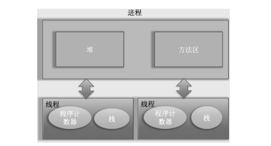

- [1.1 线程 and 进程](#11-线程-and-进程)
- [1.1 线程 and 进程](#12-线程的创建和启动)


### 1.1 线程 and 进程

### 1.2 线程的创建和启动

线程是进程中的一个实体，线程本身不会单独存在。操作系统在分配资源的时候是分配给进程的，但是 cpu 比较特殊，是分配给线程的。
所以说，线程是 cpu 调度的最小单位。

在 Java 中，当我们启动 main 就是启动了一个 jvm 的进程，而 main 函数就是所在进程中的一个线程，也叫主线程。



一个进程中有多个线程，多个线程共享进程中的堆和方法区资源，但是每个线程有自己的程序计数器和栈。

程序计数器是一块内存区域，用来记录线程当前要执行的指令地址。那么为何要将
程序计数器设计为线程私有的呢？前面说了线程是占用 CPU 执行的基本单位，而 CPU一
般是使用时间片轮转方式让线程轮询占用的，所以当前线程 CPU 时间片用完后，要让出
CPU，等下次轮到自己的时候再执行。那么如何知道之前程序执行到哪里了呢？其实程序
计数器就是为了记录该线程让出 CPU 时的执行地址的，待再次分配到时间片时线程就可
以从自己私有的计数器指定地址继续执行。另外需要注意的是，如果执行的是 native 方法，
那么 pc 计数器记录的是 undefined 地址，只有执行的是 Java 代码时 pc 计数器记录的才是
下一条指令的地址。

另外每个线程都有自己的栈资源，用于存储该线程的局部变量，这些局部变量是该线
程私有的，其他线程是访问不了的，除此之外栈还用来存放线程的调用栈帧。

堆是一个进程中最大的一块内存，堆是被进程中的所有线程共享的，是进程创建时分
配的，堆里面主要存放使用 new 操作创建的对象实例。

方法区则用来存放 JVM 加载的类、常量及静态变量等信息，也是线程共享的。

在这里面讲了 3 种创建线程的方式：
1. 继承 Thread 类
2. 实现 Runnable 接口
3. 实现 Callable 接口

从我们看的设计模式来说，第二种和第三种比较好的，是使用组合的方式，而不是继承的方式。我们说组合优于继承。

```java
// 继承 Thread 类
public class MyThread extends Thread {
    @Override
    public void run() {
        System.out.println("MyThread");
    }
}

// main
public static void main(String[] args) {
    MyThread myThread = new MyThread();
    myThread.start();
}
```

```java
// 实现 Runnable 接口
public class MyRunnable implements Runnable {
    @Override
    public void run() {
        System.out.println("MyRunnable");
    }
}

// main
public static void main(String[] args) {
    MyRunnable myRunnable = new MyRunnable();
    Thread thread = new Thread(myRunnable);
    thread.start();
}
```

```java
// 实现 Callable 接口
public class MyCallable implements Callable<String> {
    @Override
    public String call() throws Exception {
        return "MyCallable";
    }
}

// main
public static void main(String[] args) {
    MyCallable myCallable = new MyCallable();
    FutureTask<String> futureTask = new FutureTask<>(myCallable);
    new Thread(futureTask).start();
    try {
        System.out.println(futureTask.get());
    } catch (InterruptedException | ExecutionException e) {
        e.printStackTrace();
    }
}
```

第 3 种方式比第二种方式好的地方一点是，可以有返回值。

