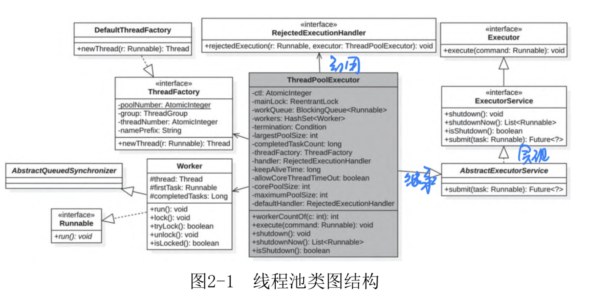
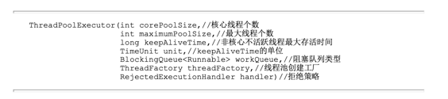

# Chapter 2 显示使用线程池和线程池异步编程
带返回结果的线程池的使用

```java
        // 上面的例子是没有返回值的情况
        Future<?> resultA = POOL_EXECUTOR.submit(ThreadPoolC2D2::methodString);

        // get() 会阻塞，等待结果
        System.out.println(resultA.get());
```

这个的确是使用了线程，但是有个问题，会阻塞 Main 线程。



`ThreadPoolExecutor` 里面的 ctl 变量，既用来标识线程池状态，也用来标识线程数量。前三位用来标识线程池的状态。



**执行一个任务的过程，线程参数有：**
* corePoolSize：核心线程数
* maximumPoolSize：最大线程数
* keepAliveTime：线程空闲时间
* unit：时间单位
* workQueue：阻塞队列, 可以指定容量
* threadFactory：线程工厂
* 拒绝策略

**线程池的状态：**
* RUNNING：接收新任务并且处理阻塞队列里的任务。
* SHUTDOWN：不接收新任务，但是处理阻塞队列里的任务。
* STOP：不接收新任务，不处理阻塞队列里的任务，中断正在执行的任务。
* TIDYING：所有任务都执行完（包含阻塞队列里面任务），当前线程池活动线程为0，将要调用terminated方法。
* TERMINATED：终止状态。terminated方法调用完成以后的状态。

**线程池之间的转换路径：**
* RUNNING → SHUTDOWN：当显式调用shutdown()方法时，或者隐式调用了finalize()，它里面调用了shutdown()方法时。
* RUNNING 或者 SHUTDOWN → STOP：当显式调用shutdownNow()方法时。
* SHUTDOWN→TIDYING：当线程池和任务队列都为空时。
* STOP→TIDYING：当线程池为空时。
* TIDYING→TERMINATED：当terminated()hook方法执行完成时。

当一个新任务进来的时候，如果当前线程数小于核心线程数，则调用 `addWorker` 新增一个核心线程执行该任务。

如果当前线程数大于 `corePoolSize`, 如果线程池状态还是处于 `running` 状态，那么新增任务到任务队列(`workQueue.offer()`)。新增任务以后，会进行二次校验，
判断线程池是否还是处于 `running` 状态，不是，则删除任务，执行拒绝策略。如果二次校验通过了，则判断线程池中是否还有线程，没有则新增一个线程(`addWorker()`)。

如果添加任务失败，表明任务队列满了，尝试调用 `addWorker()` 来新增一个线程， `addWorker()` 会判断当前的线程池线程个数是否大于 `maximumPoolSize`，
如果大于，则执行拒绝策略。

一个线程执行完毕后会调用执行清理任务，`processWorkerExit()`，统计线程池的完成任务个数。删除当前的 `worker`。判断线程池是否可以转到 `TIDYING` 状态。


